# 📊 VMware vCenter Password Management - Workflow Diagrams

## System Architecture Overview

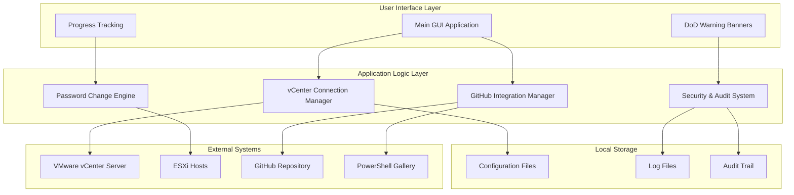

## Installation Workflow

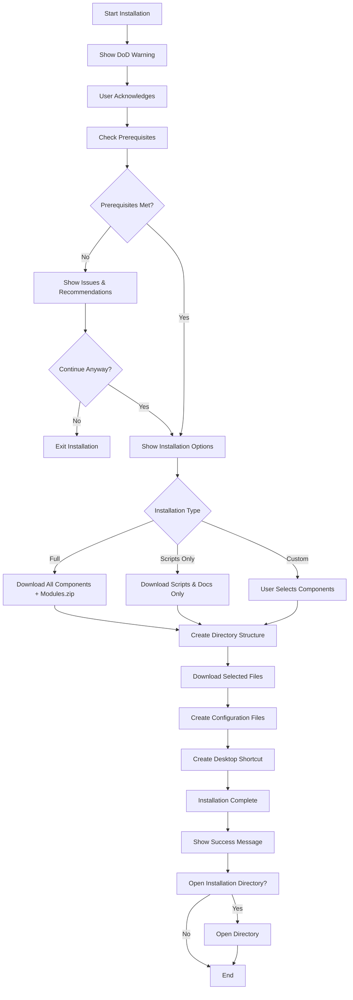

## Main Application Workflow

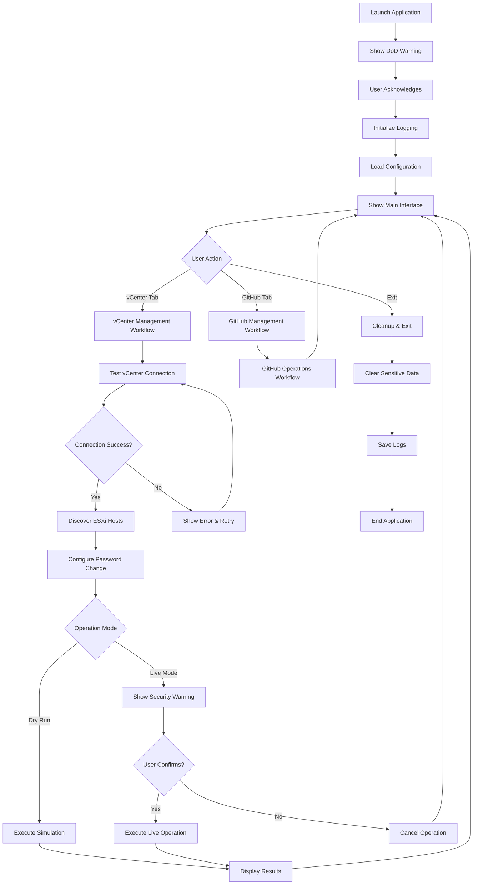

## Password Change Operation Workflow

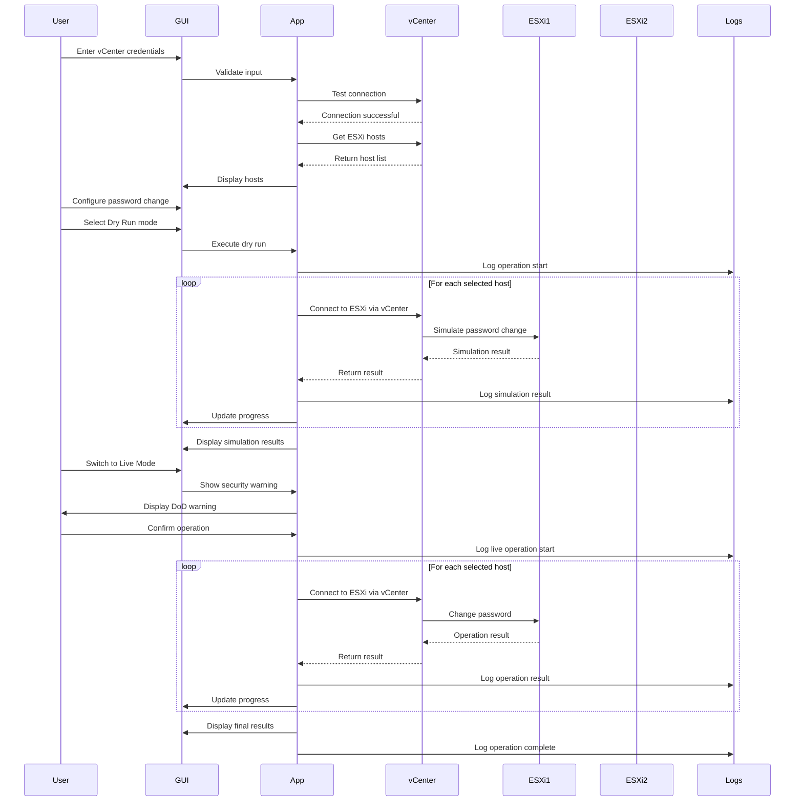

## GitHub Integration Workflow

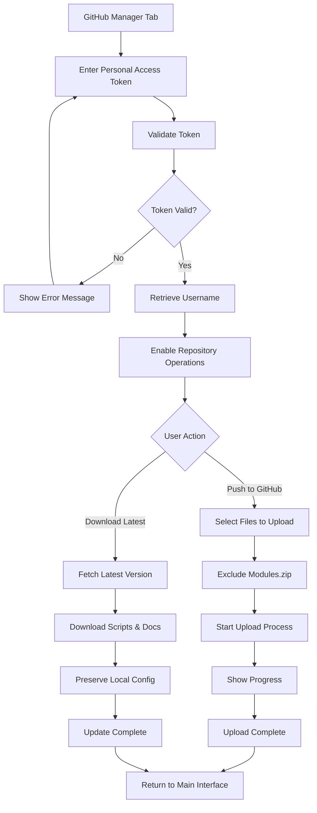

## Security & Audit Workflow

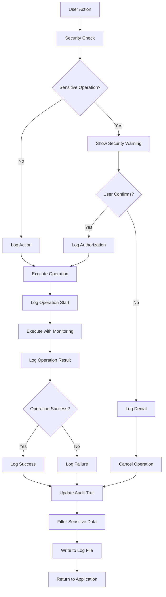

## Error Handling Workflow

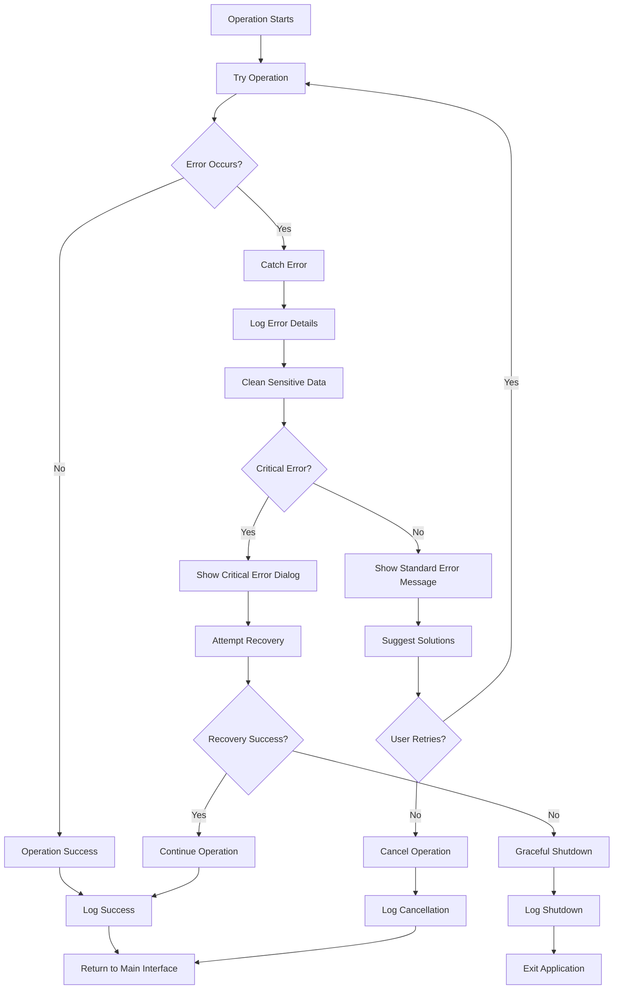

## Data Flow Diagram

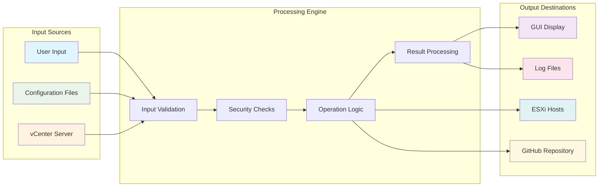

## Deployment Architecture

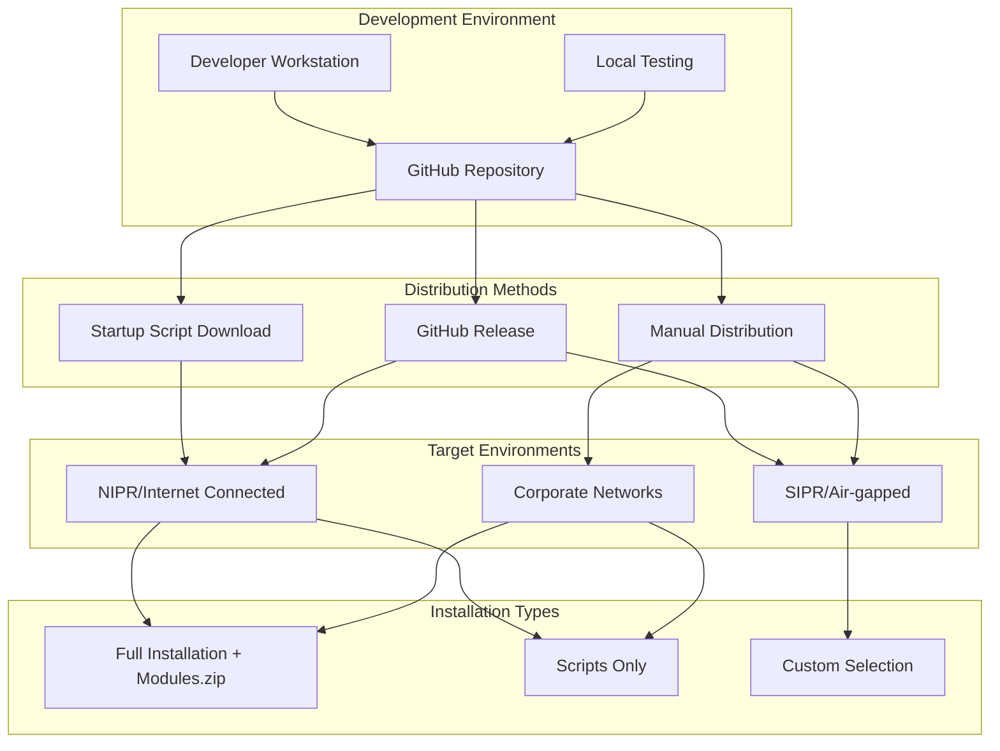

## Security Model

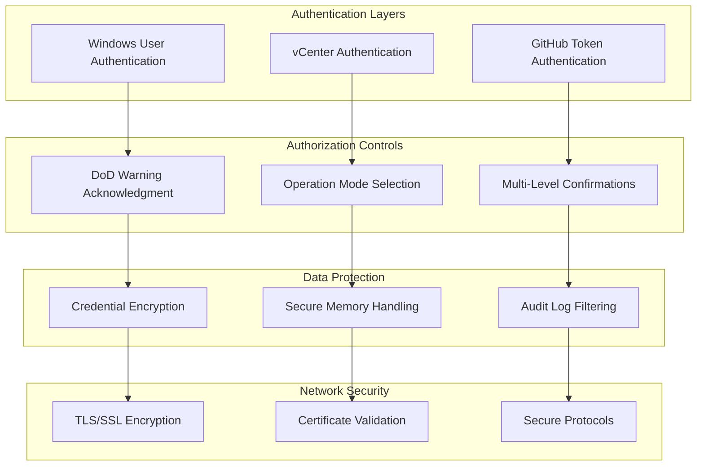

## Monitoring & Alerting

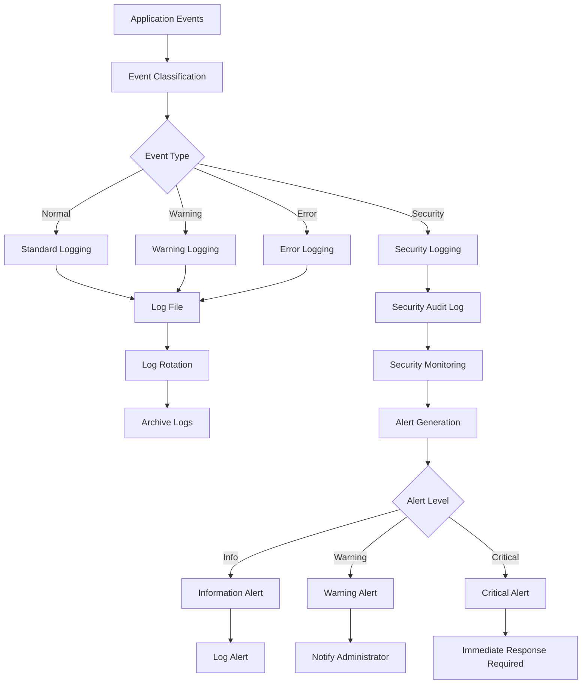

---

These workflow diagrams provide a comprehensive view of how the VMware vCenter Password Management Tool operates, from installation through daily operations, security controls, and monitoring. Each diagram focuses on a specific aspect of the system to help users and administrators understand the complete workflow and security model.