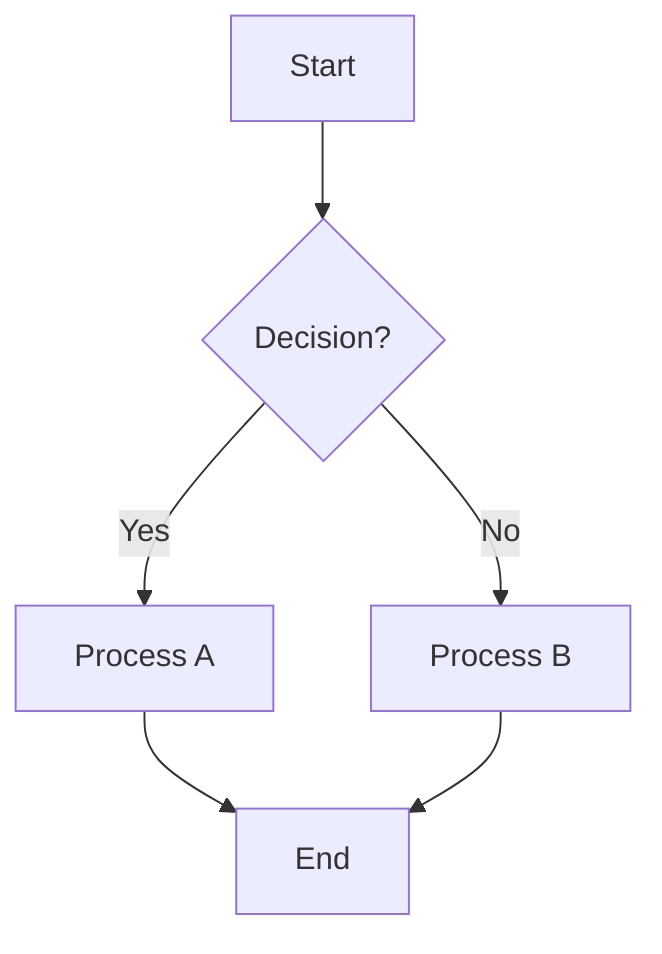
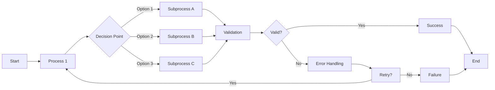
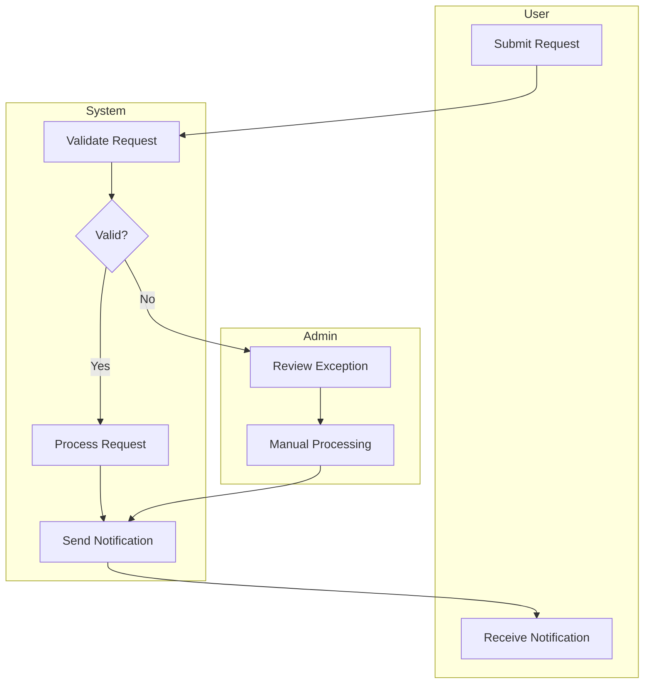

# Workflow and Flowchart Generation Prompt Template
## Professional Process Visualization Guide

### Overview

This prompt template is designed to generate clear, structured workflows and flowcharts for various business processes, technical procedures, and system designs. Use this template to request professional-grade process documentation that follows industry standards.

### Workflow/Flowchart Prompt Template

```
Create a detailed workflow/flowchart for the following process:

**PROCESS DESCRIPTION:**
[Describe the specific process, procedure, or system workflow you need visualized]

**CONTEXT:**
- Process Type: [Business Process/Technical Procedure/System Workflow/Decision Tree]
- Complexity Level: [Simple/Intermediate/Advanced]
- Target Audience: [End Users/Technical Staff/Management/General Public]
- Implementation Environment: [Manual Process/Automated System/Hybrid]
- Stakeholders Involved: [List roles and responsibilities]

**WORKFLOW REQUIREMENTS:**
1. Clear start and end points
2. Decision points with yes/no branches
3. Process steps with action descriptions
4. Error handling and exception paths
5. Parallel processes where applicable
6. Time estimates for each step
7. Responsible parties for each action
8. Input/output specifications

**VISUALIZATION FORMAT:**
- Diagram Type: [Flowchart/Swimlane/Process Map/Decision Tree/BPMN]
- Output Format: [Text-based/Mermaid/ASCII Art/Structured Description]
- Detail Level: [High-level overview/Detailed steps/Implementation-ready]
- Include Symbols: [Standard flowchart symbols/Custom notation]

**FLOWCHART ELEMENTS TO INCLUDE:**
- Start/End terminals (ovals)
- Process steps (rectangles)
- Decision points (diamonds)
- Input/Output (parallelograms)
- Connectors and flow direction
- Subprocess references
- Error handling paths
- Parallel process indicators

**ADDITIONAL REQUIREMENTS:**
[Specify any additional needs such as:]
- Compliance requirements (SOX, HIPAA, etc.)
- Performance metrics and KPIs
- Risk assessment points
- Quality control checkpoints
- Integration with existing systems
- Scalability considerations
- Security checkpoints

Please provide:
1. Step-by-step workflow description
2. Visual flowchart representation
3. Decision criteria for each branch
4. Exception handling procedures
5. Performance metrics where applicable
6. Implementation notes and considerations
```

### Workflow Types and Templates

#### 1. Business Process Workflow
```
**BUSINESS PROCESS TEMPLATE:**

Process Name: [Name of the business process]
Process Owner: [Department/Role responsible]
Process Objective: [What the process achieves]

WORKFLOW STEPS:
1. TRIGGER EVENT
   - What initiates the process
   - Input requirements
   - Preconditions

2. INITIAL PROCESSING
   - First actions taken
   - Data collection
   - Validation steps

3. DECISION POINTS
   - Criteria for decisions
   - Alternative paths
   - Escalation procedures

4. CORE ACTIVITIES
   - Main process steps
   - Resource requirements
   - Time estimates

5. QUALITY CHECKS
   - Validation points
   - Approval requirements
   - Error correction

6. COMPLETION
   - Final outputs
   - Notification procedures
   - Documentation requirements

EXCEPTION HANDLING:
- Error scenarios
- Recovery procedures
- Escalation paths
```

#### 2. Technical System Workflow
```
**TECHNICAL SYSTEM TEMPLATE:**

System Name: [Name of the technical system]
System Purpose: [Primary function and objectives]
Integration Points: [External systems and dependencies]

TECHNICAL WORKFLOW:
1. SYSTEM INITIALIZATION
   - Startup procedures
   - Configuration loading
   - Dependency checks

2. INPUT PROCESSING
   - Data validation
   - Format conversion
   - Security checks

3. CORE PROCESSING
   - Algorithm execution
   - Data transformation
   - Business logic application

4. OUTPUT GENERATION
   - Result formatting
   - Data persistence
   - Notification dispatch

5. ERROR HANDLING
   - Exception detection
   - Recovery mechanisms
   - Logging procedures

6. SYSTEM CLEANUP
   - Resource deallocation
   - Temporary data cleanup
   - Status reporting

PERFORMANCE CONSIDERATIONS:
- Throughput requirements
- Response time targets
- Resource utilization
- Scalability factors
```

#### 3. Decision Tree Workflow
```
**DECISION TREE TEMPLATE:**

Decision Context: [Situation requiring decision]
Decision Maker: [Role/person responsible]
Decision Criteria: [Factors influencing decision]

DECISION FLOW:
1. INITIAL ASSESSMENT
   - Gather information
   - Identify options
   - Assess constraints

2. EVALUATION CRITERIA
   - Primary factors
   - Secondary considerations
   - Risk assessment

3. DECISION MATRIX
   - Option A: [Conditions and outcomes]
   - Option B: [Conditions and outcomes]
   - Option C: [Conditions and outcomes]

4. IMPLEMENTATION PATH
   - Selected option execution
   - Resource allocation
   - Timeline establishment

5. MONITORING AND REVIEW
   - Success metrics
   - Review schedule
   - Adjustment procedures

ESCALATION PATHS:
- When to escalate
- Escalation hierarchy
- Documentation requirements
```

### Mermaid Flowchart Syntax Guide

#### Basic Flowchart Elements


#### Advanced Flowchart Features


#### Swimlane Diagram


### Example Usage Scenarios

#### Example 1: Software Development Workflow
```
Create a detailed workflow/flowchart for the following process:

**PROCESS DESCRIPTION:**
Software development lifecycle from requirement gathering to production deployment

**CONTEXT:**
- Process Type: Technical Procedure
- Complexity Level: Advanced
- Target Audience: Development Team and Project Managers
- Implementation Environment: Agile development with CI/CD
- Stakeholders Involved: Developers, QA, DevOps, Product Owner

**WORKFLOW REQUIREMENTS:**
1. Include all SDLC phases
2. Show parallel development and testing activities
3. Include code review and approval gates
4. Show automated testing and deployment steps
5. Include rollback procedures
6. Show monitoring and feedback loops

**VISUALIZATION FORMAT:**
- Diagram Type: BPMN with swimlanes
- Output Format: Mermaid diagram
- Detail Level: Implementation-ready
- Include Symbols: Standard BPMN notation

**ADDITIONAL REQUIREMENTS:**
- Include quality gates at each phase
- Show integration with project management tools
- Include security review checkpoints
- Show performance testing requirements
- Include documentation requirements
```

#### Example 2: Customer Service Process
```
Create a detailed workflow/flowchart for the following process:

**PROCESS DESCRIPTION:**
Customer complaint resolution process from initial contact to case closure

**CONTEXT:**
- Process Type: Business Process
- Complexity Level: Intermediate
- Target Audience: Customer Service Representatives
- Implementation Environment: CRM system with ticketing
- Stakeholders Involved: Customer, CSR, Supervisor, Technical Team

**WORKFLOW REQUIREMENTS:**
1. Multiple contact channels (phone, email, chat)
2. Escalation procedures based on severity
3. SLA compliance checkpoints
4. Customer satisfaction measurement
5. Knowledge base integration
6. Follow-up procedures

**VISUALIZATION FORMAT:**
- Diagram Type: Swimlane flowchart
- Output Format: Structured description with Mermaid
- Detail Level: Detailed steps
- Include Symbols: Standard flowchart symbols

**ADDITIONAL REQUIREMENTS:**
- Include SLA time requirements
- Show integration with CRM system
- Include customer communication touchpoints
- Show reporting and analytics collection
- Include training and knowledge management
```

### Flowchart Best Practices

#### 1. Structure and Flow
- **Single Entry Point**: Every flowchart should have one clear starting point
- **Clear Direction**: Use arrows to show flow direction consistently
- **Logical Sequence**: Arrange elements in logical reading order (top-to-bottom, left-to-right)
- **Parallel Processes**: Show concurrent activities clearly
- **Single Exit Point**: Minimize multiple endpoints where possible

#### 2. Decision Points
- **Binary Decisions**: Use yes/no questions for clarity
- **Clear Criteria**: Specify decision criteria explicitly
- **All Paths Covered**: Ensure every decision branch leads somewhere
- **Exception Handling**: Include error and exception paths

#### 3. Visual Design
- **Consistent Symbols**: Use standard flowchart symbols consistently
- **Readable Text**: Keep text concise but descriptive
- **Appropriate Spacing**: Maintain clear spacing between elements
- **Color Coding**: Use colors to group related processes or indicate status

#### 4. Documentation
- **Process Description**: Include written description alongside visual
- **Assumptions**: Document any assumptions made
- **Dependencies**: Note external dependencies and prerequisites
- **Metrics**: Include timing, volume, and performance metrics

### Common Flowchart Symbols

```
SYMBOL GUIDE:
○ Start/End (Terminal)
□ Process/Activity
◇ Decision Point
▱ Input/Output
⬟ Document
⬢ Database
⬡ Manual Operation
⬠ Preparation
⬢ Stored Data
→ Flow Direction
```

### Quality Checklist for Workflows

#### Completeness
- [ ] All process steps included
- [ ] All decision points covered
- [ ] Exception handling addressed
- [ ] Input/output specifications clear
- [ ] Responsible parties identified

#### Clarity
- [ ] Process flow is logical
- [ ] Decision criteria are clear
- [ ] Terminology is consistent
- [ ] Visual layout is readable
- [ ] Documentation is comprehensive

#### Accuracy
- [ ] Process reflects reality
- [ ] Timing estimates are realistic
- [ ] Resource requirements are accurate
- [ ] Dependencies are correctly identified
- [ ] Compliance requirements are met

#### Usability
- [ ] Target audience can understand
- [ ] Implementation guidance is clear
- [ ] Training requirements are identified
- [ ] Maintenance procedures are defined
- [ ] Success metrics are specified

This template ensures you receive professional, comprehensive workflows and flowcharts that meet industry standards and serve as effective process documentation and implementation guides.